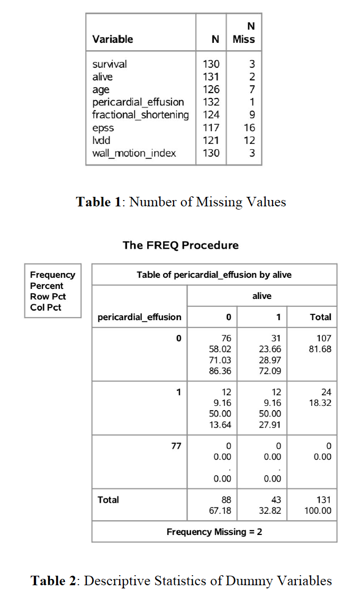
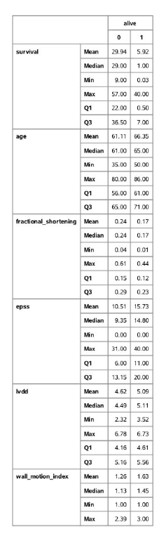
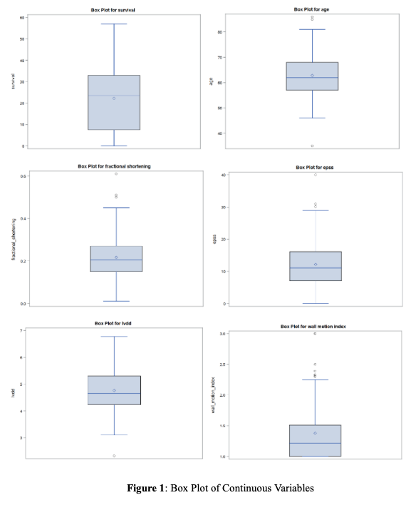
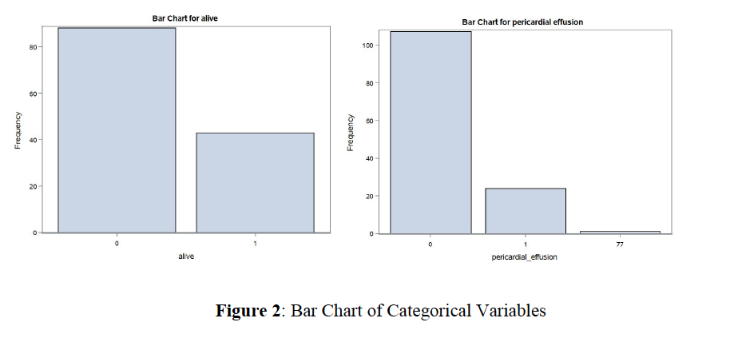
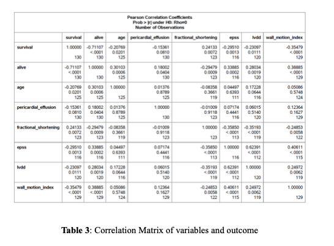
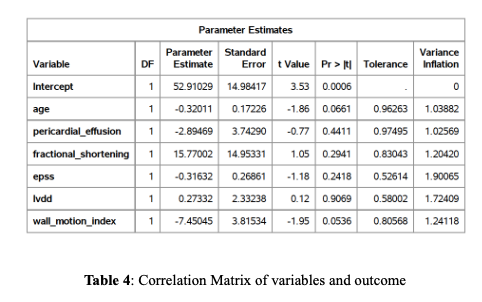
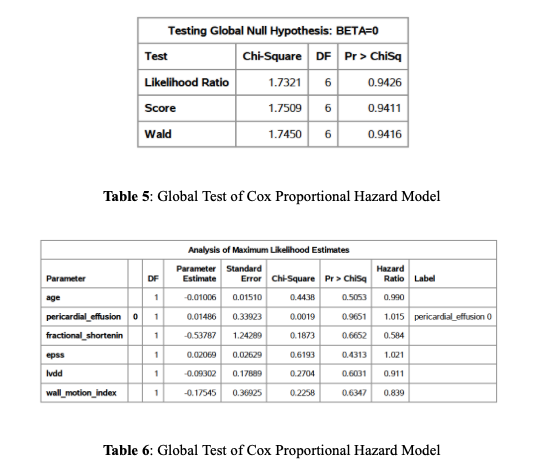
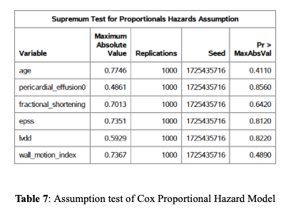
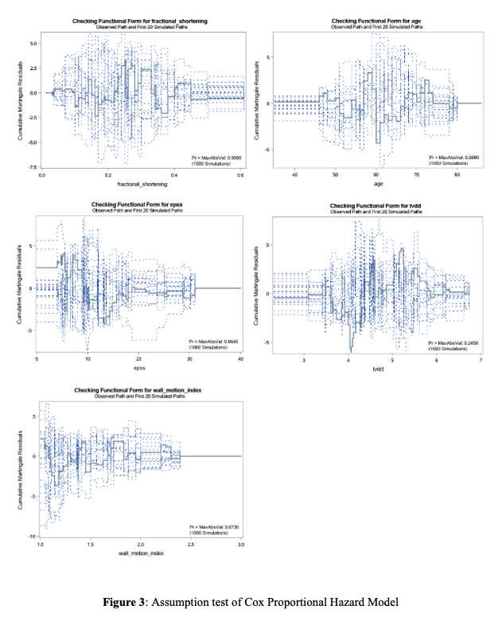

# 1.Introduction

Heart disease is the lead cause of death for men and women in the United States, causing about 1 in 4 deaths. Heart disease is a relatively general term and it can refer to several types of heart conditions. The most common type of heart disease in America is coronary artery disease (CAD), which can lead to a heart attack. Other heart disease symptoms including heart failure and Arrhythmia. Every year, about 647,000 Americans die from heart disease, and about 160,000 of them occur in people under age 65. It’s hard to predict the survival rate of patients after a heart attack because it depends on many aspects. As a result, it’s important to estimate the association between survival time after heart attack and different medical indexes in echocardiograms. This survival analysis can help researchers better forecast patients’ survival rate after heart attack based on medical indexes and design corresponding therapy plans.

# 2.Methods

*About the data*

The real-world dataset we use is donated by researchers in Johns Hopkins University and I receive it from University of California, Irvine, it contains 132 instances of patients for 12 variables describing the patient's heart attack and condition. We take into account general information such as age, medical indexes in echocardiograms such as Pericardial effusion, E-point septal separation, left ventricular end-diastolic dimension. The first step of data analysis was cleaning, renaming variables, identifying missing values, outliers and unreasonable values in the dataset.

First, we use descriptive statistics to give an overall picture of variables' character, distribution of explanatory variables are also shown. Secondly, the correlation matrix and VIF (Variance Inflation Factor) was then computed to testify whether a strong association between different predictors exist. It is also used to briefly observe the correlation between survival of patient and specific variables. Thirdly, the distribution of independent variables when disease presence and absence are shown. 

*Model Building*

Because the dataset we have is a survival dataset, I first visualized survival probability of patients changing over time through graphing Kaplan-Meier estimate of survival probability. 

And to estimate the association between medical indexes and survival rate of patients after heart attack. I fit the cox proportional hazard model where outcome is hazard function of sample and explanatory variables are medical indexes and age. Hazard function at time t is the chance of death for the patient at time t given that the patient has not failed up to that point in time.

In the Cox model, we assume that there is a baseline hazard function h0(t), which depends only on time. And we assume that the ratio of two hazard functions taking different covariates value to be constant and independent of time, in other word, covariates’ effect on hazard function of patients is independent of time. I choose to use a semi-parametric model because I am less interested in modeling the hazard rate’s dependence on time and more interested in its dependence on medical indexes or age. Cox model estimates regression parameters as covariate effects but ignores the dependence on time, which is appropriate.

The assumption of Cox model is as below:

$$
h1(t |z)=h0(t )*(z), (z)=exp(\beta'z)
$$

The model assumes that each covariate has a multiplicative effect in the hazards function that is constant over time. To test the assumption of cox proportional hazard model, I plot the cumulative martingale residuals and standardized score process of observations against the values of the explanatory variable along with 20 simulated residual patterns to explore the functional form of covariates. The p-value for the Kolmogorov-type supremum test based on 1000 simulation is also included.

# 3.Results

Table 3, Table 2 shows the result of descriptive analysis, Table 1 shows the number of missing values in independent variables. And as we can see, 2% of survival time and survival status are missing, which is also a small amount. More missing values aggregate in variable epss and lvdd. I remove 2 observations that have missing survival time and survival status. 

Patients who are dead at the end of the survival period tend to have a longer survival time, this is reasonable because as the investigation time increases, patients’ survival rate decreases. Patients who are dead at the end of the survival period tend to be younger on average. Pericardial effusion is fluid around the heart, and fluid may put pressure on the heart, which is harmful. 13.6% patients who are dead at the end of the survival period have pericardial effusion, and 27.9% patients who are alive at the end of the survival period have pericardial effusion. This does not mean that pericardial effusion is beneficial, for the two groups are not comparable and dead patients have a longer investigation time. This is the same for other medical indexes. Fractional shortening is the reduction of the length of the end-diastolic diameter that occurs by the end of systole, and a lower value is increasingly abnormal. Patients who are dead at the end of the survival period tend to have a bigger  fractional shortening on average. E-point septal separation (epss) is the distance in space separating the anterior MV leaflet from the septal wall, larger numbers are increasingly abnormal. Patients who are dead at the end of the survival period tend to have a smaller epss on average. Left ventricular end-diastolic dimension (lvdd) is a measure of the size of the heart at end-diastole. Large hearts tend to be sick hearts. The heart size and wall motion index for patients in two groups does not differ significantly. 

{height=50% width=50% }

I also check the outlier and unreasonable values in independent variables and outcome, which are shown in Figure 1 and Figure 2. Variable pericardial effusion is binary but one observation has pericardial effusion=77, therefore I remove this value. As for other variables, there exists outliers but the value they take is still possible, therefore I do not conduct any further processing.

{height=85% width=85% }

Third, I plot the correlation matrix table (Table 3) and calculate the VIF (Table 4), which are shown below. Pearson correlation coefficient between 0 and 0.3 indicate a weak association, pearson correlation coefficient between 0.3 and 0.7 indicate a moderate association. The correlation coefficient between epss and lvdd is 0.62, correlation coefficient between epss and wall motion index is 0.41, and other correlation coefficients are smaller than 0.4. High VIF indicates that the associated independent variable is highly collinear with the other variables in the model. And I tend to get concerned when a VIF is greater than 2.50, epss have the maximum VIF equal to 1.9. Based on our analysis, variable epss have more collinearity with other variables, but it is still acceptable and we do not need to do any further preprocessing.

After finishing all the data cleaning and univariate analysis, I start to fit the cox proportional hazard model, the result (Table 5, Table 6) is as below.

The global test including likelihood ratio test, wald test, score test all have p-value close to 0.9, 0.9>0.05, so under the significant level of 0.05, we can conclude that beta=0 and the model we fit is not significantly better than the null model. The p-value of all covariates including age, pericardial effusion, fractional shortening, epss, lvdd, wall motion index are all greater than 0.05. This indicates that under the significant level of 0.05, we conclude that the influence of age, pericardial effusion, fractional shortening, epss, lvdd, wall motion index on survival time of patients is not significant. 
The results above do not detect any variables that can predict the survival of patients. There are two potential reasons. First is that the sample size is too small, there are only 130 patients in the dataset after data cleaning. Second is that many demographic information and important medical indexes are not included. For example, the sex, race, blood suger level, blood pressure, serum cholestoral, chest pain. The variables we get are limited. 

I also check the proportional hazard assumption. The results (Table 7) are as below. The supremum tests calculate the proportion of simulated score processes that yielded a maximum score larger than the maximum observed score process. Here all the variables have p-value greater than 0.05. Therefore, I conclude that proportional hazards assumption holds for all of our covariates. Besides that, in Figure 3, I also check if cumulative martingale residuals fluctuate around zero. And distribution of cumulative martingale residuals does not have any structure on independent variables, which indicates the correct specification of cox model.

